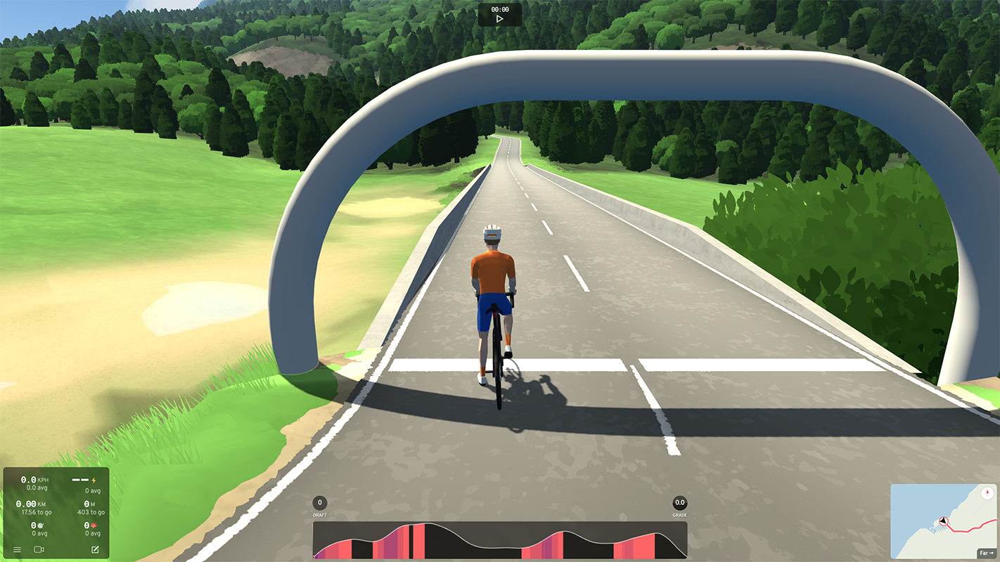
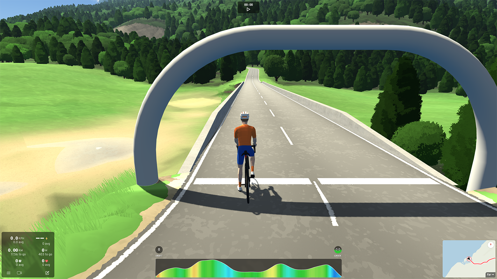

# Biketerra Gradient Colors

A Chrome extension that enhances [Biketerra](https://biketerra.com) elevation profiles with [Veloviewer](https://veloviewer.com)-inspired gradient coloring. Replaces the default elevation graph colors with a comprehensive gradient color scheme that reflects climbing and descending difficulty.

## Screenshots

### Before


### After


## Features

- **Dynamic Elevation Graphs**: Automatically recolors elevation profile SVGs with gradient-based colors
- **Grade Indicators**: Updates the GRADE stat circle with matching gradient colors
- **Customizable Colors**: Configure your own color stops and grade ranges via the options page
- **Keyboard Shortcut**: Press `G` to toggle the elevation panel between global and local zoom
- **Real-time Updates**: Monitors DOM changes to handle route reversals and dynamic content
- **Settings Sync**: Your custom colors sync across Chrome browsers when signed in

### Gradient Color System

**Climbing (positive grades):**
- **Green → Yellow**: 0-7% grade
- **Yellow → Red**: 7-14% grade
- **Red → Maroon**: 14-21% grade

**Descending (negative grades):**
- **Green → Cyan**: 0-7% grade
- **Cyan → Blue**: 7-14% grade
- **Blue → Purple**: 14-21% grade

### Customization

You can customize the gradient colors and grade ranges through the extension's options page:

1. Right-click the extension icon and select **Options**, or
2. Go to `chrome://extensions/`, find the extension, click **Details**, then **Extension options**

The options page allows you to:
- **Customize all 7 color stops**
- **Adjust the gradient range** per color band (default is 7% per band)
- **Preview your changes** in real-time before saving
- **Reset to defaults** if needed

Settings are saved to Chrome's sync storage and will apply immediately to any open Biketerra pages.

## Installation

### From Source

1. Clone this repository:
   ```bash
   git clone https://github.com/yourusername/bt-gradient-colors.git
   cd bt-gradient-colors
   ```

2. Open Chrome and navigate to `chrome://extensions/`

3. Enable "Developer mode" (toggle in the top right)

4. Click "Load unpacked"

5. Select the `package` folder from this repository

6. The extension is now installed and will automatically activate on Biketerra route pages

## Usage

1. Navigate to any route on [Biketerra](https://biketerra.com)
   - Works on spectate pages: `https://biketerra.com/spectate/*`
   - Works on ride pages: `https://biketerra.com/ride*`

2. The elevation profile will automatically be recolored with gradient colors

3. The GRADE indicator circle will display the appropriate gradient color

4. Use the `G` key to toggle the elevation panel between global and local zoom

## Development

### Prerequisites

- Node.js (for linting and formatting tools)

### Setup

Install development dependencies:

```bash
npm install
```

### Available Commands

- `npm run lint` - Check code for linting errors
- `npm run lint:fix` - Auto-fix linting and formatting errors
- `npm run format` - Format all code files with Prettier
- `npm run format:check` - Verify code is properly formatted

### Architecture

**Core Files:**
- `package/manifest.json` - Chrome extension manifest (v3)
- `package/content.js` - Main content script with all functionality
- `package/options.html` - Options page UI for customizing colors
- `package/options.js` - Options page logic for saving/loading settings
- `package/icons/` - Extension icons (16px, 48px, 128px)

**How It Works:**
1. Finds route ID from DOM elements (`.route-id` selector)
2. Fetches route data from Biketerra's API: `https://biketerra.com/ride/__data.json?route={routeId}`
3. Extracts elevation/distance data from SvelteKit-formatted JSON response
4. Processes SVG elevation graph to apply gradient coloring
5. Creates filled polygons for gradient segments
6. Updates grade indicator circles with matching colors
7. Uses MutationObserver to handle route reversals and dynamic updates

### Testing

To test changes:
1. Make code modifications in `package/content.js`
2. Run `npm run lint:fix` to ensure code quality
3. Navigate to `chrome://extensions/`
4. Click the refresh icon on the extension card
5. Reload a Biketerra ride/spectate page
6. Check browser console for `[Gradient Colors]` log messages

## Technical Details

- **No build process required** - Pure JavaScript, no bundling needed
- **Chrome Extension Manifest V3** - Uses modern extension APIs
- **Content Script Injection** - Runs at `document_idle` for optimal performance
- **DOM Observation** - Monitors SVG and stat changes for dynamic updates
- **API Integration** - Fetches route data directly from Biketerra's endpoints

## License

MIT License - see [LICENSE](LICENSE) file for details

## Credits

- Thanks to [Biketerra](https://biketerra.com) for an amazing virtual cycling platform
- Thanks to [Veloviewer](https://veloviewer.com) for the gradient color scheme

## Contributing

Contributions welcome! Please:
1. Fork the repository
2. Create a feature branch
3. Make your changes
4. Run `npm run lint:fix` before committing
5. Submit a pull request
